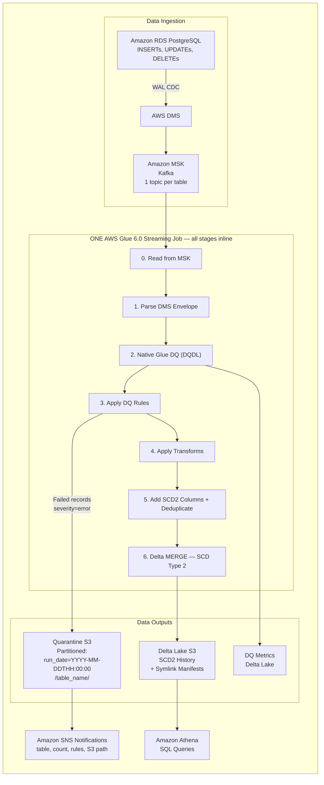

# Streaming ETL Framework with Data Quality

Config-driven CDC streaming ETL on AWS Glue 6.0. Define tables, DQ rules, transforms, and native Glue Data Quality (DQDL) checks in a single `tables.yaml` — the framework handles validation, compilation, deployment, and data generation. All processing stages run inside **one Glue streaming job** (one parallel streaming query per Kafka topic); data quality is an inline gate in that job, not a separate step.

**Amazon RDS PostgreSQL → AWS DMS (CDC) → Amazon MSK (Kafka) → AWS Glue Streaming → Delta Lake (Amazon S3)**

## Architecture

Each deployment creates a fully isolated AWS stack. The same framework code powers any use case — only the YAML config changes.



**How it works:**
- Write a `tables.yaml` — define your tables, schemas, DQ rules, transforms, and quality checks (compiled to native Glue DQ DQDL rulesets)
- Run `deploy.sh` — validates config, compiles DMS mappings + RDS DDL + CloudFormation params, deploys a complete isolated stack
- Data flows automatically: Amazon RDS → AWS DMS (CDC) → Amazon MSK (Kafka) → one AWS Glue 6.0 streaming job (all validation, transform, and merge stages inline) → Delta Lake
- Records are validated first, inside the job — only clean data proceeds to the Delta write; failures are quarantined to Amazon S3 (partitioned by hour + table) with Amazon SNS email alerts
- Query results in Amazon Athena. Each stack is fully independent — deploy multiple use cases side by side.
- Need sub-second latency for stateless validate-and-route? See the [Real-Time Mode companion example](examples/realtime-mode/README.md) (Glue 6.0).

## Features

| Feature | Description |
|---------|-------------|
| **Config-driven pipeline** | One YAML defines tables, schemas, DQ rules, transforms, and quality checks |
| **Config validation** | `config_validator.py` validates your YAML before deployment |
| **Config compilation** | `config_compiler.py` generates DMS mappings, RDS DDL, and CFn parameters |
| **DQ rules** | `range`, `allowed_values`, `regex`, `not_null`, `unique`, `length` (extensible via `register()`) |
| **Transforms** | `trim`, `lower`, `upper`, `round`, `mask_pii`, `cast`, `default_value`, `rename` (extensible via `register()`) |
| **Native Glue Data Quality** | YAML checks compile to DQDL rulesets evaluated every micro-batch; results publish to CloudWatch (`StreamingETL/DataQuality`) and to a Delta table queryable in Athena (`dq_metrics`). See the known issue below on the Glue 6.0 streaming runner. |
| **Real-Time Mode (Glue 6.0)** | Companion Scala example: stateless validate-and-route at sub-second latency ([examples/realtime-mode](examples/realtime-mode/README.md)) |
| **SCD Type 2** | History tracking with `_effective_from`, `_effective_to`, `_is_current` |
| **Quarantine** | Failed DQ records isolated with failure reason |
| **Isolated stacks** | Each deployment is a fully independent CloudFormation stack |
| **Example use cases** | `vehicle-telemetry` (5 tables) and `healthcare-iot` (2 tables, PII masking) |

> **Known issue — Glue 6.0 streaming runner (verified 2026-09-02):** the
> `gluestreaming` command currently launches its Python runner on Python 3.11
> (not the documented 3.13) and does not ship the `awsgluedq` package, so the
> native `EvaluateDataQuality` transform cannot run inside `forEachBatch`
> (batch `glueetl` jobs are unaffected). This framework detects that at runtime
> and evaluates the same DQDL rules with equivalent Spark aggregations,
> publishing results to CloudWatch and the `dq_metrics` Delta/Athena table.
> You will see a one-time `awsgluedq is not available in this runtime` warning
> in the job log — this is expected. The Glue Studio **Data quality** tab only
> populates from the native transform, so it stays empty for streaming jobs
> until AWS ships `awsgluedq` in the streaming runner; the native path then
> activates automatically with no code changes. Python dependencies are
> pip-installed via `--additional-python-modules` for the same reason — the 3.11
> runner does not provide them — and are pinned to exact versions
> (`boto3==1.42.84,PyYAML==6.0.2`) so a deploy can never pull an unexpected
> release.

## Viewing DQ Results

DQ results land in two places after the first micro-batch that has
`quality_checks` configured (allow one trigger interval after data starts
flowing).

### Amazon Athena — rule outcomes with full detail

Console: **Athena → Query editor** → set **Database** to `<stack>_db` (stack
name with hyphens as underscores, e.g. `my_etl_stack_db`). If prompted for a
query result location, use `s3://<stack>-assets-<account-id>/athena-results/`.

```sql
-- Most recent DQDL rule outcomes
SELECT table_name, batch_id, rule, outcome, failure_reason, timestamp
FROM dq_metrics
ORDER BY timestamp DESC
LIMIT 20;

-- Pass/fail summary per rule over time
SELECT table_name, rule,
       COUNT(*)                                AS evaluations,
       SUM(CASE WHEN passed THEN 1 ELSE 0 END) AS passed_batches,
       MAX(timestamp)                          AS last_evaluated
FROM dq_metrics
GROUP BY table_name, rule
ORDER BY table_name, rule;
```

More per-use-case queries (SCD2 history, quarantine analysis) live in
`examples/<use-case>/scripts/analytics_queries.sql`.

### Amazon CloudWatch — quality trend metrics

Console: **CloudWatch → Metrics → All metrics** (called **Classic metrics** in
the redesigned console) → clear any class filter → search
**`StreamingETL`** → namespace **StreamingETL/DataQuality** → dimension group
`table, column` → select metrics and set the time range to 1h+.

Metrics published per micro-batch, per table/column:
`dq.completeness`, `dq.uniqueness`, `dq.size` (and `dq.compliance` if
configured).

CLI equivalent:

```bash
aws cloudwatch get-metric-statistics \
  --namespace "StreamingETL/DataQuality" \
  --metric-name "dq.completeness" \
  --dimensions Name=table,Value=vehicle_telemetry Name=column,Value=vehicle_id \
  --start-time "$(date -u -d '1 hour ago' +%Y-%m-%dT%H:%M:%S)" \
  --end-time "$(date -u +%Y-%m-%dT%H:%M:%S)" \
  --period 300 --statistics Average --region <region>
```

Quarantined records (row-level DQ failures) are separate from these metrics —
browse `s3://<stack>-quarantine-<account-id>/run_date=<hour>/<table>/` for the
parquet files carrying `_failed_rule` lineage columns.

## Security

- No hardcoded credentials — passwords provided at deploy time via CLI, environment variables, or interactive prompt
- All secrets stored in AWS Secrets Manager, encrypted with a customer-managed AWS KMS key (rotation enabled)
- Amazon MSK SASL/SCRAM-SHA-512 authentication with TLS enforcement
- IAM database authentication enabled on Amazon RDS
- Per-Lambda IAM roles with least-privilege policies
- All Amazon S3 buckets: SSE-KMS encryption, versioning, access logging, TLS-only bucket policies, Block Public Access
- Amazon SNS topic encrypted with AWS KMS
- VPC isolation with private subnets, security group references (no broad CIDRs), and VPC Flow Logs
- Lambda concurrency limits on all functions
- Amazon MSK broker logging to Amazon CloudWatch

See [SECURITY.md](SECURITY.md) for the full security design, accepted debt, and production hardening recommendations.

## Availability & Networking (demo scope)

This template is optimized for a low-cost, single-Region demo, not for high
availability. Two deliberate single-AZ choices to be aware of before any
production use:

- **One NAT Gateway in a single public subnet** provides egress for both private
  subnets. An outage in that AZ cuts off private-subnet egress (Lambda → AWS APIs,
  Glue → MSK).
- **The Glue → MSK connection pins a single subnet/AZ.** If that AZ is impaired,
  the streaming job cannot reach the brokers.

MSK brokers (2, across both private subnets) and RDS (Multi-AZ) are themselves
spread across AZs. For production, add a NAT Gateway per AZ and make the Glue
connection AZ-resilient. These are not "fault tolerant" as shipped.

## Prerequisites

- AWS account with permissions for AWS CloudFormation, Amazon RDS, AWS DMS, Amazon MSK, AWS Glue, Amazon S3, AWS IAM, AWS Lambda, AWS Secrets Manager, Amazon Athena, AWS KMS, Amazon SNS
- EC2 instance running Amazon Linux 2023 (or any Linux with git)

## Getting Started

### 1. Install git

```bash
sudo dnf install -y git && git --version
```

### 2. Clone the repo

```bash
git clone https://github.com/<your-org>/<your-repo>.git && cd <your-repo> && chmod +x scripts/*.sh
```

### 3. Run EC2 setup. Takes ~3 mins

Installs Python 3.10 and PyYAML for the **deploy host** (config validator/compiler and deploy tooling). The Glue job itself runs Python 3.13 on the Glue 6.0 managed runtime — nothing to install for that.

```bash
./scripts/setup-ec2.sh
```

### 4. Configure AWS credentials

Option 1 — IAM Instance Profile (recommended): attach an IAM role with the required permissions to your EC2 instance.

Option 2 — AWS CLI:

```bash
aws configure
# Enter: Access Key ID, Secret Access Key, Region, Output format (json)
```

Verify:

```bash
aws sts get-caller-identity
```

### 5. Deploy

#### Set your variables:

```bash
STACK="my-etl-stack"
REGION="us-east-1"
USE_CASE="vehicle-telemetry"   # Options: vehicle-telemetry | healthcare-iot
SNS_EMAILS=""                  # Optional: comma-separated emails for DQ failure alerts
```

#### Deploy the stack (~35-40 mins end-to-end, Amazon MSK is the long pole):

> Timing: MSK cluster creation takes ~30 min and is the bottleneck; RDS (~15-17 min) provisions in parallel, so CloudFormation completes in ~31 min. `deploy.sh` then spends a few more minutes uploading assets and publishing the three Lambda layers, and `post-deploy.sh` adds ~3-5 min. Plan for roughly 35-40 minutes to a fully working pipeline.

Passwords can be provided three ways (choose one):

**Option A — Interactive prompt (recommended, most secure):**
```bash
./scripts/deploy.sh --stack-name $STACK --use-case $USE_CASE --region $REGION
# You will be prompted to enter RDS and MSK passwords securely (input hidden)
```

**Option B — CLI flags:**
```bash
./scripts/deploy.sh --stack-name $STACK --use-case $USE_CASE --region $REGION \
  --rds-password "YourRdsPass123" --msk-password "YourMskPass123"
```

**Option C — Environment variables:**
```bash
export RDS_PASSWORD="YourRdsPass123"
export MSK_PASSWORD="YourMskPass123"
./scripts/deploy.sh --stack-name $STACK --use-case $USE_CASE --region $REGION
```

> Passwords must be 8-41 characters from: letters, digits, and `!#$%^&*()_+=.:,-` (no quotes, backslashes, braces, slashes, `@`, or spaces — enforced by the template). On stack updates, previously set passwords are reused automatically if not provided again.

#### Run post-deploy setup:

Creates RDS tables, Kafka topics, starts AWS DMS + AWS Glue, creates Amazon Athena tables, seeds test data, and subscribes SNS emails.

```bash
./scripts/post-deploy.sh --stack-name $STACK --use-case $USE_CASE --region $REGION --emails "$SNS_EMAILS"
```

#### Generate more test data:

```bash
./scripts/post-deploy.sh --stack-name $STACK --use-case $USE_CASE --region $REGION \
  --skip-tables --skip-topics --skip-dms --skip-glue
```

Or invoke the data generator Lambda directly:

```bash
aws lambda invoke --function-name ${STACK}-data-generator \
  --payload '{"action": "burst", "records": 200}' /tmp/out.json --region $REGION
cat /tmp/out.json
```

#### Teardown when done:

```bash
./scripts/teardown.sh --stack-name $STACK --region $REGION --force
```

## Project Structure

```
├── cloudformation/
│   └── streaming-etl.yaml              # Parameterized CloudFormation template
├── examples/
│   ├── vehicle-telemetry/
│   │   ├── config/tables.yaml          # 5 tables: vehicles, drivers, telemetry, deliveries, alerts
│   │   └── scripts/
│   │       ├── data_generator.py       # Lambda: seed/generate/burst with DQ violations, SCD2
│   │       └── analytics_queries.sql
│   ├── healthcare-iot/
│   │   ├── config/tables.yaml          # 2 tables: patients, vitals (PII masking, clinical ranges)
│   │   └── scripts/
│   │       ├── data_generator.py       # Lambda: seed/generate/burst with PII, clinical DQ
│   │       └── analytics_queries.sql
│   └── realtime-mode/                  # Glue 6.0 Real-Time Mode companion (Scala)
│       ├── realtime_dq_route.scala     # Stateless validate-and-route, sub-second latency
│       └── README.md                   # Constraints, deploy, and verify instructions
├── scripts/
│   ├── deploy.sh                       # Validate, compile, deploy stack, upload assets
│   ├── post-deploy.sh                  # Create tables/topics, start DMS/Glue, seed data
│   ├── teardown.sh                     # Full resource cleanup
│   └── setup-ec2.sh                    # One-command deploy-host setup (Python 3.10, PyYAML)
├── src/
│   ├── glue_streaming_job.py           # Main Glue 6.0 streaming job (domain-agnostic)
│   ├── glue_dq_analyzer.py             # Native Glue DQ analyzer (EvaluateDataQuality)
│   ├── dqdl_compiler.py                # YAML -> DQDL ruleset compiler (pure Python)
│   ├── config_validator.py             # Config validation
│   └── config_compiler.py              # Compiles config → DMS mappings, DDL, CFn params
│                                       # (No binaries are committed: Lambda layers are
│                                       # built from pinned PyPI versions at deploy time,
│                                       # and Glue job deps are pip-installed at job
│                                       # start; no JARs needed on Glue 6.0)
├── SECURITY.md                         # Security design, accepted debt, hardening guide
├── CONTRIBUTING.md
├── CODE_OF_CONDUCT.md
├── LICENSE                             # MIT-0 License
└── README.md
```

## Configuration

Each use case is defined by a single `tables.yaml`. Here's a condensed example:

```yaml
settings:
  checkpoint_location: "s3://${STACK_NAME}-assets-${AWS_ACCOUNT_ID}/checkpoints/"
  quarantine_path: "s3://${STACK_NAME}-quarantine-${AWS_ACCOUNT_ID}/"
  delta_bucket: "${STACK_NAME}-delta-${AWS_ACCOUNT_ID}"
  trigger_interval: "15 seconds"

kafka:
  bootstrap_servers: "PLACEHOLDER_BOOTSTRAP_SERVERS"
  security_protocol: "SASL_SSL"
  sasl_mechanism: "SCRAM-SHA-512"
  sasl_username: "kafkaadmin"

source_database:
  engine: "postgres"
  schema_name: "public"

tables:
  - name: vehicle_telemetry
    topic: cdc-vehicle_telemetry
    delta_path: "s3://${STACK_NAME}-delta-${AWS_ACCOUNT_ID}/vehicle_telemetry/"
    primary_key: id
    schema:
      - {name: id, type: integer, nullable: false}
      - {name: vehicle_id, type: integer, nullable: true}
      - {name: speed_kmh, type: double, nullable: true}
      - {name: latitude, type: double, nullable: true}

    dq_rules:
      - {id: tel_001, type: range, column: latitude, params: {min: -90, max: 90}, severity: error}
      - {id: tel_002, type: not_null, column: vehicle_id, params: {}, severity: error}

    transforms:
      - {id: tel_tx_001, type: round, column: latitude, params: {decimals: 5}, order: 1}

    quality_checks:   # compiled to a native Glue DQ (DQDL) ruleset, e.g.
                      # Rules = [Completeness "vehicle_id" >= 0.95, Uniqueness "id" >= 1.0]
      - {metric: completeness, column: vehicle_id, threshold: 0.95, severity: warning}
      - {metric: uniqueness, column: id, threshold: 1.0, severity: error}
```

## DQ Rules Reference

| Rule | Parameters | Description |
|------|------------|-------------|
| `range` | `min`, `max` | Value must be within numeric range |
| `allowed_values` | `values` (list) | Value must be in the allowed set |
| `regex` | `pattern` | Value must match the regex pattern |
| `not_null` | — | Value must not be null |
| `unique` | — | Value must be unique within the batch |
| `length` | `min`, `max` | String length must be within range |

Custom rules can be added via `register()` in the DQ engine.

## Transform Rules Reference

| Transform | Parameters | Description |
|-----------|------------|-------------|
| `trim` | — | Strip leading/trailing whitespace |
| `lower` | — | Convert to lowercase |
| `upper` | — | Convert to uppercase |
| `round` | `decimals` | Round numeric value |
| `mask_pii` | `visible_chars` | Mask all but last N characters |
| `cast` | `to_type` | Cast column to a different type |
| `default_value` | `value` | Fill nulls with a default value |
| `rename` | `new_name` | Rename the column |

Custom transforms can be added via `register()` in the transform engine.

## Creating a New Use Case

1. Create `examples/<your-use-case>/config/tables.yaml` with your table definitions, DQ rules, transforms, and quality checks.
2. Optionally create `examples/<your-use-case>/scripts/data_generator.py` for test data generation.
3. Deploy:
   ```bash
   ./scripts/deploy.sh --stack-name <name> --use-case <your-use-case> --region <region>
   ./scripts/post-deploy.sh --stack-name <name> --use-case <your-use-case> --region <region>
   ```

## Service Versions

| Service | Version |
|---------|---------|
| Amazon RDS PostgreSQL | 16.11 |
| Amazon MSK (Kafka) | 3.6.0 (default; set via the `KafkaVersion` parameter) |
| AWS DMS | 3.5.4 |
| AWS Glue | 6.0 (Spark 4.1, Python 3.13, Scala 2.13) |
| Data quality | Native AWS Glue Data Quality (DQDL) — ships with the runtime |
| Delta Lake | Bundled with the Glue 6.0 runtime (`--datalake-formats delta`) |

## Cost Estimate

AWS Glue 6.0 is priced **30% lower** than previous AWS Glue versions
([announcement](https://aws.amazon.com/about-aws/whats-new/2026/08/aws-glue-6-0-price-reduction-iceberg-v3/)).
Check the [AWS Glue pricing page](https://aws.amazon.com/glue/pricing/) for the
current per-DPU-hour rate in your Region.

| Resource | Estimated Cost | Notes |
|----------|---------------|-------|
| Amazon MSK (2 brokers) | ~$200/month | kafka.t3.small |
| Amazon RDS PostgreSQL | ~$15/month | db.t3.micro, Multi-AZ enabled |
| AWS Glue 6.0 Streaming | ~$35/month | 2 DPUs, 30% below the previous Glue rate (when running) |
| AWS DMS Replication | ~$30/month | dms.t3.small |
| Amazon S3 Storage | ~$5/month | Varies with data volume |
| NAT Gateway | ~$35/month | $0.045/hour + data transfer |

Stop the AWS Glue job when not testing. Use `./scripts/teardown.sh` when done.

## Troubleshooting

| Issue | Solution |
|-------|----------|
| Unable to locate credentials | Configure AWS CLI or attach IAM role to EC2 |
| AWS DMS task fails | Check security groups, verify Amazon RDS credentials in AWS Secrets Manager |
| No data in Kafka | Ensure AWS DMS task is running, check table mappings |
| AWS Glue job fails | Check Amazon CloudWatch logs, verify Amazon MSK bootstrap servers |
| Stack fails: "maximum number of VPCs has been reached" | The Region's VPC quota (default 5) is exhausted; delete an unused VPC or request a quota increase, then delete the ROLLBACK_COMPLETE stack shell and redeploy |
| `awsgluedq is not available in this runtime` warning in the job log | Expected — see the known issue above; DQ results still flow to CloudWatch and `dq_metrics` |
| Glue Studio Data quality tab shows "No runs with data quality results" | Expected for streaming jobs — see the known issue above; query `dq_metrics` in Athena instead |
| Empty Delta tables | Verify Kafka topics have data, check checkpoints |
| `dq_metrics` empty in Athena right after deploy | The table populates after the first micro-batch with configured `quality_checks`; re-run the Athena table creator Lambda (`{"action": "create_all"}`) if the table itself is missing |
| KMS AccessDeniedException | Ensure Lambda IAM roles have `kms:Decrypt` on the KMS key |

## License

This library is licensed under the MIT-0 License. See the [LICENSE](LICENSE) file.
